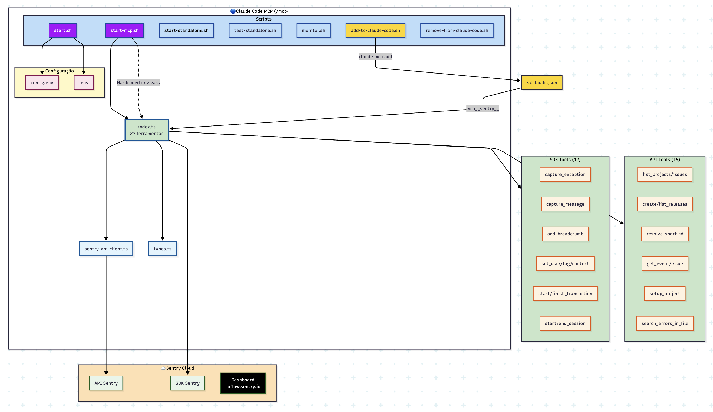

# 🔄 Diagrama Comparativo: MCP Sentry (Claude Code vs Cursor)

## Diagrama de Arquitetura e Relações



## 📊 Tabela Comparativa Detalhada

| Aspecto | MCP Claude Code | MCP Cursor |
|---------|-----------------|------------|
| **Localização** | `/mcp-sentry` | `/sentry-mcp-cursor` |
| **Ferramentas** | 27 (12 SDK + 15 API) | 27 (12 SDK + 15 API) |
| **Configuração** | `.env` e `config.env` | `config.env` e `.cursor/mcp.json` |
| **Script Principal** | `start.sh` | `start-cursor.sh` |
| **Instalação** | `add-to-claude-code.sh` | `add-to-cursor.sh` ✨ |
| **Monitor** | `monitor.sh` ✅ | `monitor.sh` ✨ |
| **Prefixo Tools** | `mcp__sentry__` | `mcp__sentry__` |
| **Registro** | `~/.claude.json` | `.cursor/mcp.json` |

## 🔄 Fluxo de Execução

### Claude Code:
```
1. ./add-to-claude-code.sh
   ↓
2. Registra em ~/.claude.json
   ↓
3. Claude Code carrega start.sh
   ↓
4. start.sh → config.env/.env
   ↓
5. Inicia node dist/index.js
   ↓
6. 27 ferramentas disponíveis com prefixo mcp__sentry__
```

### Cursor:
```
1. ./add-to-cursor.sh
   ↓
2. Registra em .cursor/mcp.json
   ↓
3. Cursor carrega start-cursor.sh
   ↓
4. start-cursor.sh → config.env (com fallback)
   ↓
5. Inicia node dist/index.js
   ↓
6. 27 ferramentas disponíveis com prefixo mcp__sentry__
```

## 🎯 Principais Diferenças

### 1. **Scripts de Inicialização**
- **Claude Code**: `start.sh` (genérico)
- **Cursor**: `start-cursor.sh` (otimizado para Cursor)

### 2. **Configuração**
- **Claude Code**: Usa `.env` ou `config.env`
- **Cursor**: Prioriza `config.env` com fallback hardcoded

### 3. **Registro**
- **Claude Code**: Global em `~/.claude.json`
- **Cursor**: Local em `.cursor/mcp.json`

### 4. **Scripts Exclusivos**
- **Claude Code**: Originou `monitor.sh`
- **Cursor**: Adicionou `add-to-cursor.sh`

### 5. **Melhorias Cross-Platform**
- Monitor do Claude Code → Adaptado para Cursor
- Config.env do Cursor → Pode beneficiar Claude Code

## 🔗 Relações e Dependências

### Compartilhado:
- ✅ Mesmo código core (index.ts)
- ✅ Mesmas 27 ferramentas
- ✅ Mesmo cliente API
- ✅ Mesmos tipos TypeScript
- ✅ Mesmas credenciais Sentry

### Diferente:
- ❌ Métodos de registro
- ❌ Scripts de inicialização
- ❌ Localização da configuração
- ❌ Scripts de instalação

## 💡 Conclusão

Ambos os MCPs são funcionalmente idênticos (27 ferramentas), mas diferem na:
1. **Integração com o editor** (Claude Code vs Cursor)
2. **Scripts de gerenciamento** (otimizados para cada plataforma)
3. **Localização de configuração** (global vs local)

As melhorias podem ser compartilhadas entre ambos, como demonstrado com o `monitor.sh`.